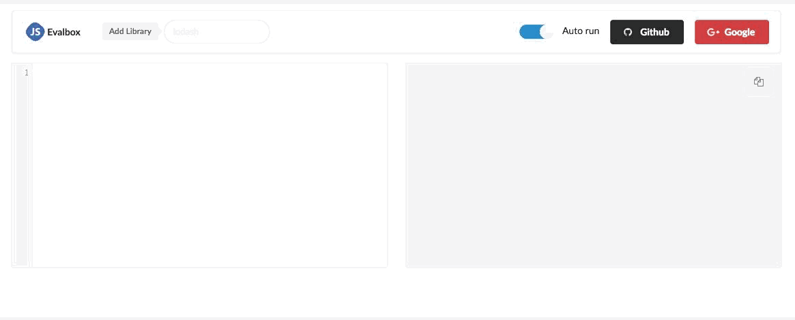

> Evaluate Javascript code safely with Iframe Sandbox

history                                          4.10.1        4.10.1   5.0.0  evalbox

*Read more about [sandbox here][1]*

## Get starter

 - `yarn`
 - `npm run start`

-------

**This help you in some way?** [Buy me a coffee][coffee]  :)   
https://buymeacoff.ee/ridermansb

[1]: https://www.html5rocks.com/en/tutorials/security/sandboxed-iframes/
[coffee]: https://buymeacoff.ee/ridermansb
